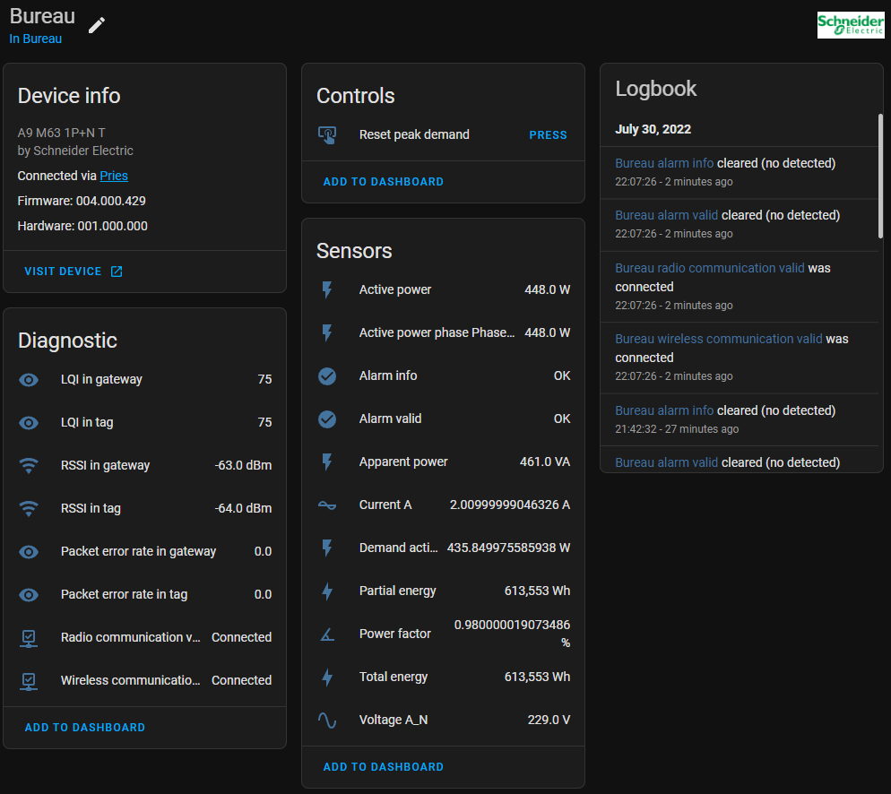
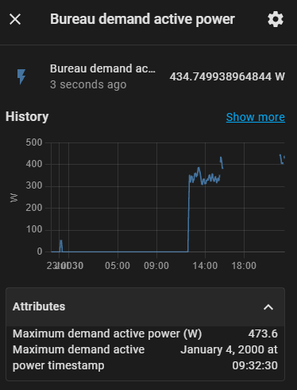
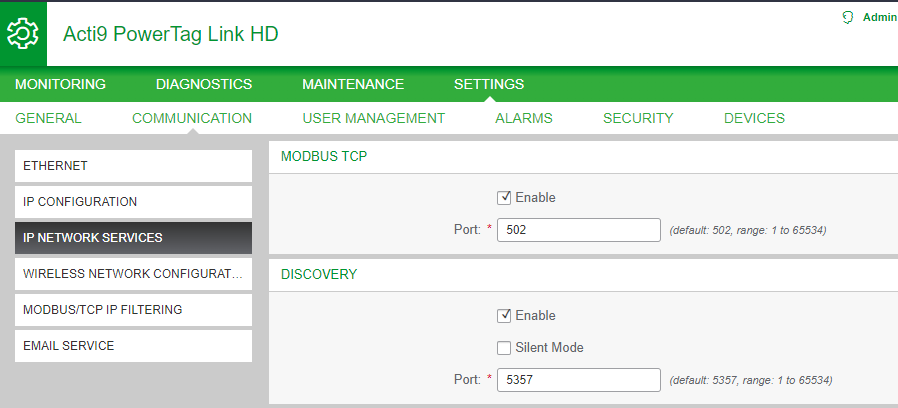
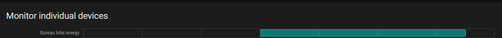

# EcoStruxure PowerTag Link Gateway

An integration to fully integrate Schneider's PowerTag ecosystem into Home Assistant.
This will enable monitor electric circuits in great detail.

## Features

* **Current**: per phase and rated current
* **Voltage**: per phase, total and rated voltage
* **Power**: active, apparent and power factor
* **Energy**: partial (resettable) and total
* **Demand**: active power, maximum active power (resettable) and timestamp of maximum active power
* **Alarm**: current state and its reasons
* **Diagnostics**: gateway status, LQI, RSSI, packet loss, connectivity status

## Compatibility

### Gateways

* A9XMWD20: Acti9 PowerTag Link
* A9XMWD100: Acti9 PowerTag Link HD

### PowerTags

* A9MEM1520: PowerTag Monoconnect 63A 1P+Wire top and bottom
* A9MEM1521: PowerTag Monoconnect 63A 1P+N top position
* A9MEM1522: PowerTag Monoconnect 63A 1P+N bottom position
* A9MEM1540: PowerTag Monoconnect 63A 3P top and bottom position
* A9MEM1541: PowerTag Monoconnect 63A 3P+N top position
* A9MEM1542: PowerTag Monoconnect 63A 3P+N bottom position
* A9MEM1543: PowerTag Monoconnect 230V LL 63A 3P top and bottom position
* A9MEM1560: PowerTag Flex 230V 63A 1P+N top and bottom position
* A9MEM1561: PowerTag phaseNeutral 63A 1P+N top position
* A9MEM1562: PowerTag phaseNeutral 63A 1P+N bottom position
* A9MEM1563: PowerTag PhaseNeutral 63A 1P+N bottom position for RCBO 18mm Slim
* A9MEM1564: PowerTag Flex 110V 63A 1P+N top and bottom position
* A9MEM1570: PowerTag Flex 63A 3P+N top and bottom position
* A9MEM1571: PowerTag phaseNeutral 63A 3P+N top position
* A9MEM1572: PowerTag phaseNeutral 63A 3P+N bottom position
* A9MEM1573: PowerTag Flex 63A 3P top and bottom position
* A9MEM1574: PowerTag Flex 127/220V 63A 3P+N top and bottom position
* A9MEM1580: PowerTag Flex 160A 3P/3P+N top and bottom position
* A9MEM1590: PowerTag Rope 200A 3P/3P+N top and bottom position
* A9MEM1591: PowerTag Rope 600A 3P/3P+N top and bottom position
* A9MEM1592: PowerTag Rope 1000A 3P/3P+N top and bottom position
* A9MEM1593: PowerTag Rope 2000A 3P/3P+N top and bottom position
* LV434020: PowerTag NSX - 250 A - 3P
* LV434021: PowerTag NSX - 250 A - 3P+N
* LV434022: PowerTag NSX - 630 A - 3P
* LV434023: PowerTag NSX - 630 A - 3P+N

#### Further integrations

> **Warning**
>
> The following PowerTags are not yet supported, but are compatible with the Link Gateway.
> If integration is desired, please [create an issue](https://github.com/Breina/PowerTagGateway/issues) requesting it as an additional feature.
> 
> As it is not practical to integrate a device one doesn't have, consider sending the PowerTag to a maintainer of this project.

* A9XMC1D3, A9XMC2D3
* A9XMWRD
* SMT10020

# Installation

## Preparation

It is assumed that you have configured your gateway and all of its powertags.

A hard requirement for this integration to work is the modbus TCP service to be enabled, which it is by default.
To check whether this is the case, open the device's configuration webpage through navigating to its IP address in your web browser.

Navigate to _SETTINGS_ > _IP NETWORK SERVICES_

Check that the _MODBUS TCP_ service is enabled.
Its port is set to 502 by default, if you diverge from this, **please keep your port number in mind for later**.

To make your life easier later, it's also recommended to enable the _DISCOVERY_ service, its port doesn't matter.

## Installation

### HACS

> **Note**
> 
> This integration requires [HACS](https://github.com/hacs/integration) to be installed

1. Open HACS
2. _+ EXPLORE & DOWNLOAD REPOSITORIES_
3. Find _EcoStruxure PowerTag Link Gateway_ in this list
4. _DOWNLOAD THIS REPOSITORY WITH HACS_
5. _DOWNLOAD_
6. Restart Home Assistant (_Settings_ > _System_ > _RESTART_)

### Integration

 1. Navigate to the integrations page: _Settings_ > _Devices & Services_
 2. _+ ADD INTEGRATION_
 3. Select _PowerTag Link Gateway_ in this selection window
 4. **Search the network?** If the *DISCOVERY* service is enabled, the *Discover automatically* option can be checked. 
    Otherwise, move on to the next step.
    1. If the discovery was successful, the next step will present you with the gateways which were discovered.
       Select one or choose to set the host address manually.
 5. Enter the host address (without `http://`) and the modbus TCP port (default 502) of your gateway.
 6. If successful, you can now select to which areas the new devices belong.
    All entities are now created.

### Adding to the energy dashboard

 1. Navigate to the energy configuration page: _Settings_ > _Dashboards_ > _Energy_
 2. Depending on where you added your PowerTags, press _ADD DEVICE_ or _ADD_SOLAR_PRODUCTION_.
 3. Select the PowerTag entity you want to add (ends with _'total energy'_)
 4. _SAVE_