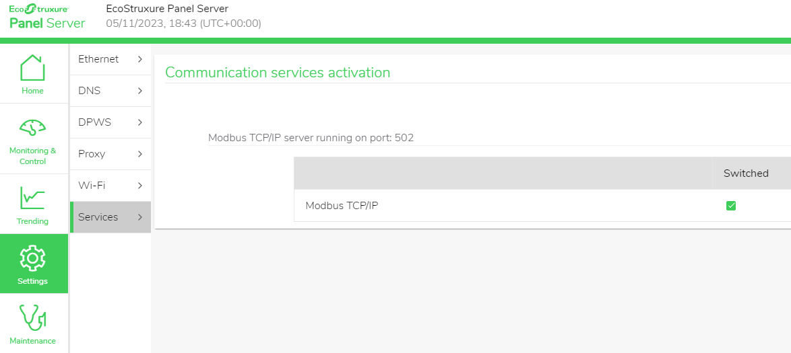
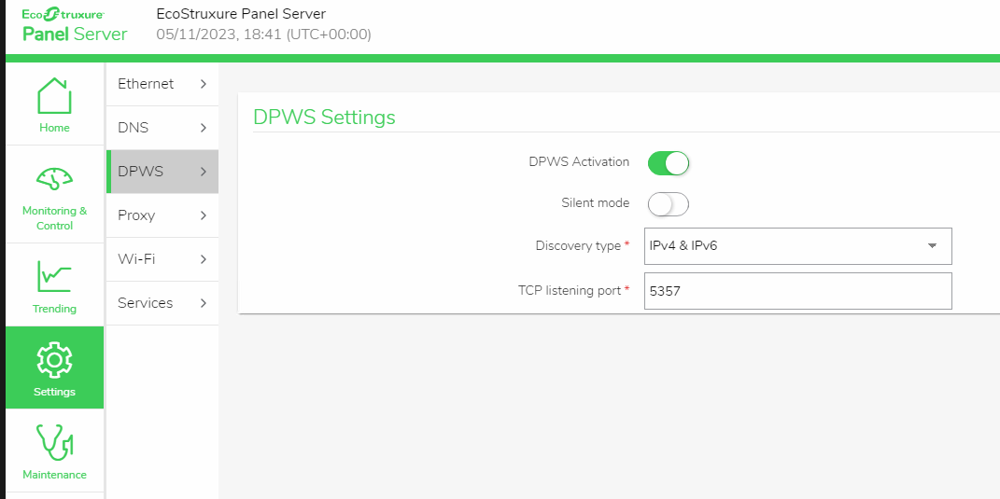

# EcoStruxure PowerTag Link Gateway

An integration to fully integrate Schneider's PowerTag ecosystem into Home Assistant.
This will enable monitor electric circuits in great detail.

## Features

* **Current**: per phase and rated current
* **Voltage**: per phase, total and rated voltage
* **Power**: active, apparent and power factor
* **Energy**: partial (resettable) and total
* **Demand**: active power, maximum active power (resettable) and timestamp of maximum active power
* **Alarm**: current state and its reasons
* **Diagnostics**: gateway status, LQI, RSSI, packet loss, connectivity status

## Compatibility

### Gateways

* A9XMWA20: Acti 9 Smartlink SI D
* A9XMWD20: Acti9 PowerTag Link
* A9XMWD100: Acti9 PowerTag Link HD
* PAS400: EcoStruxure Panel Server - entry - 110-277 VAC/DC
* PAS600: EcoStruxure Panel Server - universal - 110-277 VAC/DC
* PAS600L: EcoStruxure Panel Server - universal - 24 VDC
* PAS800: EcoStruxure Panel Server - advanced datalogger - 110-277 VAC/DC
* PAS800L: EcoStruxure Panel Server - advanced datalogger - 24 VDC
* PAS800P: EcoStruxure Panel Server - advanced datalogger - PEO

### Wireless Devices

* All PowerTags
* Acti9 Active
* ZBRTT1 (soon)

#### Further integrations

If there's something you're missing, please create a GitHub issue. 

# Installation

## Preparation

It is assumed that you have configured your gateway and all of its powertags.

A hard requirement for this integration to work is the modbus TCP service to be enabled, which it is by default.
To check whether this is the case, open the device's configuration webpage through navigating to its IP address in your web browser.

Check that the _MODBUS TCP_ service is enabled.
Its port is set to 502 by default, if you diverge from this, **please keep your port number in mind for later**.

To make your life easier later, it's also recommended to enable the _DISCOVERY_ service, its port doesn't matter.

### PowerTag Link

1. Navigate to _SETTINGS_ > _IP NETWORK SERVICES_
2. Enable Modbus TCP
3. Optional: Enable Discovery
4. Save

_The IP services configuration_

### SmartLink

Follow the same steps as for PowerTag Link.

> [!IMPORTANT]  
> In addition, SmartLink users need to configure the modbus addresses of their wireless devices 
> from 150 upwards to 169 without skipping one.

### Panel Server

1. Navigate to _Settings_ > _Network communication_ > Services
2. Enable Modbus TCP/IP
3. _Save_ > _Save_
4. Optional: activate discovery
   1. Navigate to _Settings_ > _Network communication_ > Ethernet
   2. Under _Switched port settings_, disable _IPv6 activation_. The library perform DPWS discovery does not currently support IPv6. If you need this, you can not use discovery and will need to enter the device's IP address manually. [GitHub issue](https://github.com/andreikop/python-ws-discovery/issues/58)
   3. _Save_ > _Save & apply configuration_
   4. Navigate to _Settings_ > _Network communication_ > DPWS
   5. Enable _DPWS Activation_
   6. _Save_ > _Save_

_The modbus service configuration_

_The DPWS service configuration_

## Installation

### HACS

> **Note**
> 
> This integration requires [HACS](https://github.com/hacs/integration) to be installed

1. Open HACS
2. _+ EXPLORE & DOWNLOAD REPOSITORIES_
3. Find _EcoStruxure PowerTag Link Gateway_ in this list
4. _DOWNLOAD THIS REPOSITORY WITH HACS_
5. _DOWNLOAD_
6. Restart Home Assistant (_Settings_ > _System_ > _RESTART_)

### Integration

 1. Navigate to the integrations page: _Settings_ > _Devices & Services_
 2. _+ ADD INTEGRATION_
 3. Select _PowerTag Link Gateway_ in this selection window
 4. **Search the network?** If the *DISCOVERY* service is enabled, the *Discover automatically* option can be checked. 
    Otherwise, move on to the next step.
    1. If the discovery was successful, the next step will present you with the gateways which were discovered.
       Select one or choose to set the host address manually.
 5. Enter the host address (without `http://`) and the modbus TCP port (default 502) of your gateway.
 6. If successful, you can now select to which areas the new devices belong.
    All entities are now created.

### Adding to the energy dashboard

 1. Navigate to the energy configuration page: _Settings_ > _Dashboards_ > _Energy_
 2. Depending on where you added your PowerTags, press _ADD DEVICE_ or _ADD_SOLAR_PRODUCTION_.
 3. Select the PowerTag entity you want to add (ends with _'total energy'_)
 4. _SAVE_
